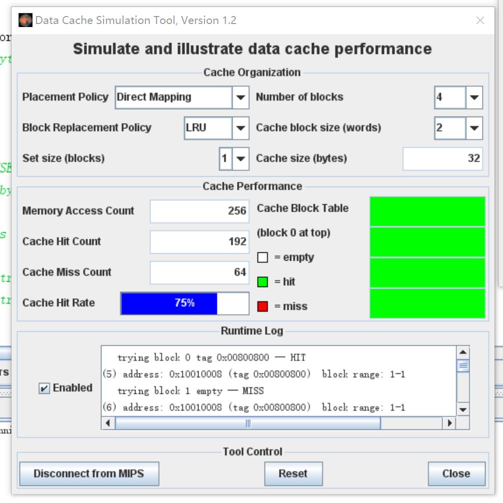

## 实践4 实验报告
陈文迪 519021910071

#### Exercise 1: Cache Visualization

**场景1：（使用cache.s）**

**问题回答：**


1.  cache命中率为0%。

   

2. 在这种设置下，我们每次会访问一个字长（4个字节）的数据，而访问的跨度为8个字（32个字节）。因此，在整个过程中，我们会访问整个数组中4个位置的元素（大小均为一个字）。对于cache来说，由于每个缓存块的大小为2个字，而一共有四个缓存块，缓存总大小恰好为8个字，与访问跨度相等，这就导致每次访问的数据块其对应的缓存块其实是同一个。我们的程序每次循环仅仅会产生一次缓冲访问，而该缓存块已经被上一次访问的数据所占据，导致cache miss。当我们将其替换成新的数据块后，又会导致下一次的cache miss。这就是为什么cache命中率为0。

3. 不能。因为所有需要访问的数据对应的缓存块仍然是同一个，每次缓存块所保存的数据始终是上一次访问的数据块。我们从可以将rep count改为8，可以从结果中验证我们的结论。


4. 当我们这样设置program parameters时，可以让hit rate最大化。

   ```assembly
   main:	li	$a0, 128		# array size in BYTES (power of 2 < array size)
           li	$a1, 1			# step size  (power of 2 > 0)
           li	$a2, 4			# rep count  (int > 0)
           li	$a3, 1			# 0 - option 0, 1 - option 1
   ```

   

此时，我们一次访问相邻的字，并且每次循环我们进行一次cache读一次cache写。相邻的字保证一个缓存块中可以同时缓存两个字。并且这种访问方式，所有的数据不会被对应到一个缓存块中，缓存的利用率得到了提高。

**场景2：（使用cache.s）**

**问题回答：**

1.  缓存命中率为75%。

   

2. 因为在这种条件下，两次循环的间隔为2个字，而一个缓存块的大小为4个字，因此两次相邻的循环只需要一次cache miss。由于每次循环会访问两次cache，因此$\text{cache hit rate}=\frac{4-1}{4}=75\%$。

3. 由于我们采用的是4路组相联，cache总大小为256bytes，恰好覆盖了整个数组的空间，每个需要访问的数据块都可以被映射到一个cache块中而不需要替换。因此，经过一次rep之后，所有的数据都可以被保存在cache中，后续的所有访问都是cache hit。因此重复无限次后，命中率为100%。


#### Exercise 2: Loop Ordering and Matrix Multiplication

