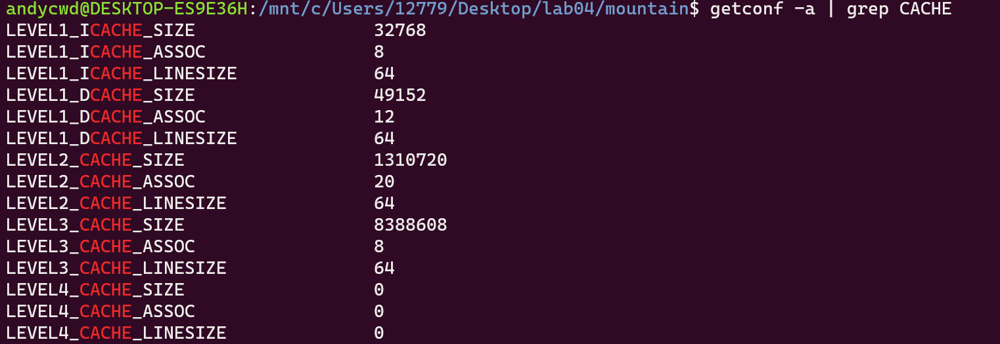

## 实践4 实验报告

陈文迪 519021910071

#### Exercise 1: Cache Visualization

**场景1：（使用cache.s）**

**问题回答：**

1.  cache命中率为0%。

   

2. 在这种设置下，我们每次会访问一个字长（4个字节）的数据，而访问的跨度为8个字（32个字节）。因此，在整个过程中，我们会访问整个数组中4个位置的元素（大小均为一个字）。对于cache来说，由于每个缓存块的大小为2个字，而一共有四个缓存块，缓存总大小恰好为8个字，与访问跨度相等，这就导致每次访问的数据块其对应的缓存块其实是同一个。我们的程序每次循环仅仅会产生一次缓冲访问，而该缓存块已经被上一次访问的数据所占据，导致cache miss。当我们将其替换成新的数据块后，又会导致下一次的cache miss。这就是为什么cache命中率为0。

3. 不能。因为所有需要访问的数据对应的缓存块仍然是同一个，每次缓存块所保存的数据始终是上一次访问的数据块。我们从可以将rep count改为8，可以从结果中验证我们的结论。


4. 当我们这样设置program parameters时，可以让hit rate最大化。

   ```assembly
   main:	li	$a0, 32		# array size in BYTES (power of 2 < array size)
           li	$a1, 2		# step size  (power of 2 > 0)
           li	$a2, 100	# rep count  (int > 0)
           li	$a3, 1		# 0 - option 0, 1 - option 1
   ```

   

此时，我们两次相邻访问间的跨度为2个字，并且每次循环我们进行一次cache读一次cache写，写的时候必然cache hit。这种跨度保证了每次相邻访问的数据位于不同的缓存块。此外，我们将数组大小设置为32字节，与缓存的总容量一样。这样经过一次遍历之后，所有的数据都会被缓存到cache中，后续的全部访问都会cache hit。这样重复100次后，hit rate接近100%。

**场景2：（使用cache.s）**

**问题回答：**

1.  缓存命中率为75%。

   

2. 因为在这种条件下，两次循环的间隔为2个字，而一个缓存块的大小为4个字，因此两次相邻的循环只需要一次cache miss。由于每次循环会访问两次cache，因此$\text{cache hit rate}=\frac{4-1}{4}=75\%$。

3. 由于我们采用的是4路组相联，cache总大小为256bytes，恰好覆盖了整个数组的空间，每个需要访问的数据块都可以被映射到一个cache块中而不需要替换。因此，经过一次rep之后，所有的数据都可以被保存在cache中，后续的所有访问都是cache hit。因此重复无限次后，命中率为100%。


#### Exercise 2: Loop Ordering and Matrix Multiplication

**问题回答：**

- 

  从测试结果上可以看到 kij&ikj具有最好的性能，而jki&kji具有最差的性能。

- 和我的观察一致。当我们以步长0访问数组元素的时候，由于我们所访问的始终是同一个地址的数据，缓存命中率为100%；当我们以步长1访问数组元素的时候，我们的缓存命中率为$1-(\frac{\text{数组元素大小}}{\text{缓存块大小}})$；而当我们以步长为n访问数组元素时，由于通常由$n>>\text{缓存块大小}$，此时的缓存命中率为0。由于我们总的循环次数是一样的，因此每次循环迭代的平均缓存命中率会极大地影响程序的总体性能。可以看到，kij&ikj之所以具有最好的性能，正是因为其具有最低的未命中总次数即最高的缓存命中率。

- 

  可以看到性能几乎没有改善，这说明经过高级别编译器优化（例如使用寄存器变量加速变量读写）和硬件优化，程序的时间局部性、空间局部性已经得到了较好的利用，不需要在进行人为的优化。

  我们可以在“-O0”的情况下进行再次实验。先测试未优化版本。

  

  再测试优化版本。

  

  可以看到在低级别编译器优化的情况下，人为的优化对于效率还是有所帮助的，如使用寄存器变量来代替访问cache以加速。

- 第一点，当我们顺序访问数组时，硬件可以采用硬件预取的方式获得额外的优化；而当步长很大时，硬件预取失效。第二点，上文分析时，我们假设缓存块大小是数组元素大小的4倍，而实际元器件中缓存块大小会更大，可以存储更多的数组元素。这就导致对于 kij&ikj，其单次迭代的未命中总次数可以更小，而对于jki&kji，其单次迭代的未命中总次数仍然为2。这就拉大了两者的差距。 

#### Exercise 3: Cache Blocking and Matrix Transposition


可见，代码正确。

**Part 1：改变矩阵的大小**


**问题回答：**

在我们的测试中，当矩阵的规模较大的时候，使用矩阵分块实现的矩阵转置比原始方法更快。我们可以从缓存失效次数的角度进行分析。假设一个缓存块中可以存储8个数组元素。则原始方法的总缓存失效次数为$n^2\times (\frac{1}{8}+1)=\frac{9n^2}{8}$，而采用分块的方法总缓存失效次数为$(\frac{n}{blocksize})^2 \times\frac{2blocksize^2}{8}=\frac{n^2}{4}$。但是由于矩阵分块需要更多的循环嵌套（4个），而循环语句会导致额外的开销。当矩阵规模较小时，这些开销占据主导，导致分块更慢；当矩阵规模较大时，cache miss 产生的开销占据主导。

**Part 2：改变分块大小（Blocksize）**


**问题回答：**

我们可以看到当blocksize增加时性能先上升再降低。开始性能上升是因为此时两个分块的大小小于缓存的容量$2blocksize^2\le C$，此时我们之前的推导是成立的。并且，通过硬件预取等技术，更大的分块可以提高缓存利用率，增加局部性和命中率；此外，内层循环的次数也减小，循环语句导致的开销也减小了。因此，总体性能上升。但是当分块大小更大的时候，此时两个分块的大小大于缓存容量$2blocksize^2> C$，此时cache miss导致的开销占据主导，性能下降。事实上，当分块大小变为10000时，分块策略就退化成了原始策略。

#### Exercise 4. Memory Mountain

**问题回答：**

- 运行结果如下：

  

- 我们选取步长stride=8，不同工作集大小情况下的吞吐率如下：

  

  从上方图表中可以看出几条明显的分界线，因此该系统的一级高速缓存、二级高速缓存和三级高速缓存的大小分别为32KB、1024KB和8MB。

- 

  可以看出一级高速缓存、二级高速缓存和三级高速缓存的大小分别为48KB、1280KB和8MB。与我们的推测非常接近。

- 

  可以看到从stride=8开始，读吞吐量基本保持不变，因此高速缓存的块大小应该为$8\times 8B=64B$。

#### Exercise 5: Memory Mountain（附加题，选做）


**问题回答：**

- 从测试图像上来看，二级缓存的大小应该是1MB。我们可以固定某一大小的stride，例如64B，可以看到访存延迟有两个主要的分界线，其中第二条分界线出现在工作集为1MB处，因此二级缓存的大小为1MB。我们固定工作集大小为1MB，继续观察，可以发现从stride为64B开始，访存延迟基本不变，因此单个二级缓存块的大小为64B。

- 通过类似的分析，我们可以发现三级缓存的大小为8MB。观察图像，二级缓存命中时的访问延迟大约为2.6ns，三级缓存命中时的延迟大约为9ns，因此二级缓存的miss penalty大约为6.4ns。

- 我们先假设二级缓存是16路组相联，则我们可以观察步长为64KB的情况。当工作集为1M时，第0组恰好填满，此时访存延迟很低；当工作集为2M时，此时出现cache miss，需要进行替换，访存延迟大大增加。该假设满足条件。

  其次，我们假设是32路组相联，则我们可以观察步长为32KB的情况。此时无论工作集为1M还是2M，访问的延迟都比较高。若我们假设是8路组相联，则我们可以观察步长为128KB的情况。此时无论工作集为1M还是2M，访问的延迟很低。因此，这两种假设均不成立。

  因此，我们分析得出二级缓存应该为16路组相联。查看硬件信息后我发现真实情况为20路组相联，还是比较符合我们的推测的。

- 本机测试无法测得主存大小。从教材图中，我们发现512MB的曲线没有出现在图中，因此主存大小应该为512MB。

- 对本题的题意并不是很清楚。

