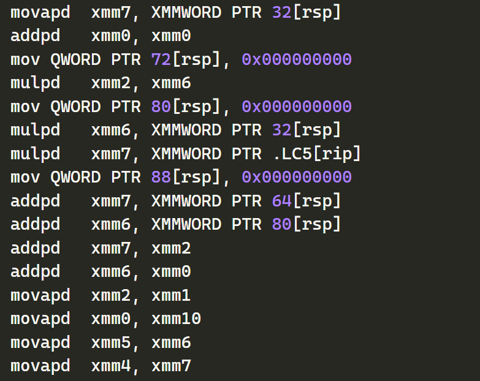
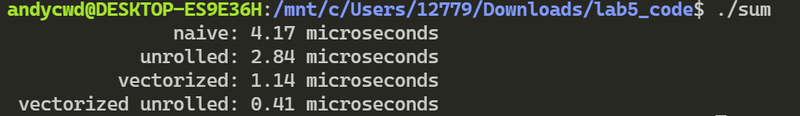

## 实践5 实验报告

陈文迪 519021910071

#### Exercise 1: 熟悉 SIMD intrinsics 函数

**问题回答：**

- 4 个并行的单精度浮点数除法

  ```c
  __m128 _mm_div_ps (__m128 a, __m128 b)
  ```

- 16 个并行求 8 位无符号整数的最大值

  ```c
  __m128i _mm_max_epu8 (__m128i a, __m128i b)
  ```

- 8 个并行的 16 位带符号短整数的算术右移，有两种形式，后者为立即数

  ```c
  __m128i _mm_sra_epi16 (__m128i a, __m128i count)
  ```

  ```c
  __m128i _mm_srai_epi16 (__m128i a, int imm8)
  ```

#### Exercise 2: 阅读 SIMD 代码



movapd（Move Aligned Packed Double-Precision Floating-Point Values），mulpd（Multiply Packed Double-Precision Floating-Point Values），addpd（Add Packed Double-Precision Floating-Point Values）指令均是执行SIMD操作的。

#### Exercise 3: 书写 SIMD 代码

我们可以按照以下代码实现：

```c
static int sum_vectorized(int n, int *a)
{
    // WRITE YOUR VECTORIZED CODE HERE
	__m128i sum = _mm_setzero_si128();
	__m128i temp = _mm_setzero_si128();

	for (int i = 0; i < n / 4 * 4; i += 4)
    {
        temp = _mm_loadu_si128(a+i);
		sum = _mm_add_epi32(temp,sum);
    }

    int ans = 0;
	int *vector = malloc(sizeof(int)*4);
	_mm_storeu_si128(vector,sum);
	for(int i = 0;i<4;i++){
		ans+=vector[i];
	}
	free(vector);

	for (int i = n / 4 * 4; i < n; i++)
	{
		ans += a[i];
	}
    return ans;
}
```

**运行结果：**


可以看到，使用向量加法函数之后性能得到了改善。

#### Exercise 4：Loop Unrolling 循环展开

在练习3的基础上，我们将循环展开，实现如下：

```c
static int sum_vectorized_unrolled(int n, int *a)
{
    // UNROLL YOUR VECTORIZED CODE HERE
	__m128i sum = _mm_setzero_si128();

	for (int i = 0; i < n / 16 * 16; i += 16)
    {
		sum = _mm_add_epi32(_mm_loadu_si128(a+i),sum);
		sum = _mm_add_epi32(_mm_loadu_si128(a+i+4),sum);
		sum = _mm_add_epi32(_mm_loadu_si128(a+i+8),sum);
		sum = _mm_add_epi32(_mm_loadu_si128(a+i+12),sum);
    }

    int ans = 0;
	int *vector = malloc(sizeof(int)*4);
	_mm_storeu_si128(vector,sum);
	for(int i = 0;i<4;i++){
		ans+=vector[i];
	}
	free(vector);

	for (int i = n / 16 * 16; i < n; i++)
	{
		ans += a[i];
	}
    return ans;
}
```

**运行结果：**



可以看到，性能进一步提升。

