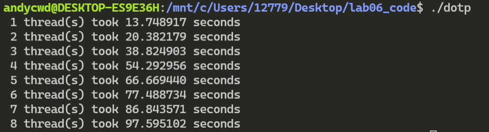

## 实践6 实验报告

陈文迪 519021910071

#### Exercise 1：向量加法 Vector Addition

1. **运行结果：**

   可以看到，``method_1()``并没有很好地利用多线程的优势，增加线程后运行速度并没有加快，与``method_2()``相比速度较慢。``method_1()``运行较慢的主要原因是因为其采用的任务分解模式让不同线程所访问的数据是相邻的，这就会导致假共享的问题：缓存是按块分割的，为了保证各线程的缓存一致，当一个线程修改了某一缓存块中的数据后，其他线程由于需要访问相邻元素，需要额外花费不必要的时间进行缓存更新，导致开销，线程数越多、单次写导致的开销越大。

2. **测试结果：**

   

    从结果中可以看出``method_3()``的性能相较于``method_1()``有很大提升，虽然与``method_2()``还有一点差距，但线程数比较多的情况下差距已经非常小。

   **实现代码：**

   ```c
   void method_3(double *x, double *y, double *z)
   {
   #pragma omp parallel
     {
       // your code here:
       int gap = ARRAY_SIZE / omp_get_num_threads() + 1;
       int n = omp_get_thread_num();
       for (int i = gap * n; i < gap * (n + 1) && i < ARRAY_SIZE; ++i)
       {
         z[i] = x[i] + y[i];
       }
     }
   }
   ```


#### Exercise 2: Dot Product

1. **测试结果：**

   

   从结果中确实可以观察到线程数越多，性能反而越差。其原因是因为每做一次乘法都需要进入临界区，而多个线程竞争临界区时只有单个线程可以进入，其他线程需要等待，这样反复的竞争会产生开销。

2. **测试结果：**

   

   可以看到相比于``dotp_1()``，``dotp_2()``的性能得到了极大提高，并且随着线程数量的增多，性能逐步提高。

   **实现代码:**

   ```c
   double dotp_2(double* x, double* y) {
       double global_sum = 0.0;
       #pragma omp parallel
       {
         // your code here: modify dotp_1 to improve performance
         double local_sum = 0;
           #pragma omp for
           for(int i=0; i<ARRAY_SIZE; i++) {
             local_sum += x[i] * y[i];
           }
           #pragma omp critical
             global_sum += local_sum;
       }
       return global_sum;
   }
   ```
   
3. **测试结果：**

   ``reduction``语句的作用是指明了对于该列表中的变量，在每个线程创建、初始化的同时需要创建该变量的私有副本，并在循环执行完成后，使用规约运算符将所有的副本变量归约到全局共享变量中。例如在本例中，将为每个线程创建一个global_sum的副本，并在循环结束之后将他们累加起来作为global_sum的值。

   

   ``dotp_3()``的性能与``dotp_2()``相近，与``dotp_1()``相比得到了极大的提升。
